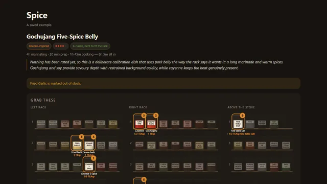

# Spice



What do I need for pork belly, and where is it on the rack. That's the only question
Spice answers, and it answers it by drawing my actual shelf.

Live: https://spice.yaqzan.dev

I own too many spices to hold the shelf in my head, and every recipe app assumes a rack
that isn't mine. Ask a generic chat window for a recipe and you get a list of names;
you're still the one translating "smoked paprika" into "second shelf, third jar, next
to the cumin." Spice keeps one registry of every jar I own, its aliases, and its shelf
position, and every recipe it writes gets checked against that registry before it's
allowed on screen. The picture you see is generated from the same layout data the app
uses to place the jar.

Salt is the one place a recipe app can quietly be wrong. Diamond Crystal and Morton
kosher salt differ by 71% per teaspoon by volume, so a recipe that says "a spoon" is
really only correct for one specific salt brand. Spice stores salt in grams, a
brand-independent unit, and only converts to spoons at the moment it renders a card, for
whichever brand I've told it I actually keep on the counter. Getting this wrong once
cost a dish that scored 2 out of 10.

The recipe card groups spices into numbered bowls in the order they go in the pan. That ordering comes from one tuple in the rack registry, so
the bowl numbers on the card and the physical premix order in the kitchen can never
drift apart. A rating I leave after cooking, plus whether the salt or heat landed,
feeds straight back into the system prompt for the next recipe, and the prompt itself is
rebuilt from live database state on every single request. The predecessor project this
replaced kept its system prompt as static text, and it froze, never updating as I
changed my mind about the rack.

There's no login screen. The app decides who I am from the raw TCP connection, not a
header, so a public tunnel sitting in front of it can't be tricked into impersonating me
by forging `X-Forwarded-For`. Off the tailnet, the site is a read-only public exhibit;
on it, it's mine.

`.claude/` holds the guidance I give Claude Code when it works in this repo. I develop
with agents heavily, and the docs there are the project's memory.

## Running it

This assumes my specific spice rack, my Tailscale network, and a Windows machine. Here's
what actually matters if you wanted to run it yourself:

```powershell
python -m spice serve            # API + built SPA on :5003
python -m spice ask "pork belly" --lb 1.5
python -m spice rate 12 8 --salt -1
pytest                           # no network or API key needed
```

An OpenRouter API key goes in `data/openrouter.key` (gitignored) or the
`OPENROUTER_API_KEY` environment variable. Without a key the rack, history, and settings
still work; asking for a recipe just says a key is missing. `SPICE_OPEN=1` treats every
caller as the owner and is for local development only, since loopback is where the
public tunnel lands.

## Layout

```
spice/
  rack.py       the registry: names, aliases, handling rules, default shelf
  schema.py     the JSON contract, name resolution, measurement formatting
  prompt.py     system prompt, assembled fresh from live state every request
  db.py         layout, stock, recipes, ratings, spend ledger
  auth.py       tailnet check, daily spend cap
  recipes.py    request pipeline, rack view, re-shelve proposal
  vault.py      a rating reminder line in my Obsidian to-do
frontend/       Vite + React + TypeScript
ops/            cloudflared tunnel, Caddy config
tests/          no network or API key needed to run
```

## Status

Live and in daily use for actual cooking. This is a snapshot of a private working repo;
the commit history isn't published.

## License

MIT
